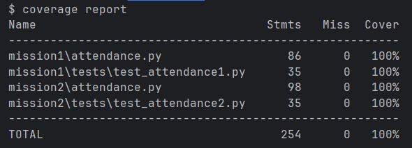

# 1. Test Coverage 확인
```bash
git clone https://github.com/rmsidgo1/CRA6-.git
cd CRA6-
pytest --cov
coverage report
```
---

# 2. Test Coverage


---

# 3. Requirements Checklist
|  요구사항 체크리스트  |  상태  |
|:------------:|:----:|
|      D1      |  O   |
|      D2      |  O   |
|      D3      |  O   |
|      D4      |  O   |
|      D5      |  O   |